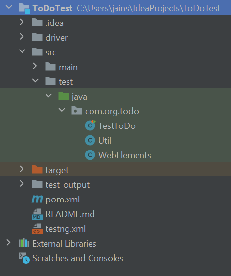

#Todo webapp

This is a web application is used to add the todo items in the list where user can perform -

Add item
Edit item
Delete item
Clear completed item

#Objective

To analyse the web app and identify the possible positive and negative scenarios to test. 
Also automate the scenarios to reduce the manual efforts

#Scenarios created and automated

#1-5 are the positive scenarios and 6-9 are negative scenarios

1. Verify that user is able to add the item in todo list
2. Verify that user is able to edit the item in todo list
3. Verify that user is able to delete the item from todo list
4. Verify that user is able to clear te completed todo task from the list
5. Verify that user is not able to add item with only space
6. Verify user should not be able to keep the list block/item empty
7. Verify user is not able to change the item when checked already
8. Verify user able to clear the page on refresh and values don't get retained
   or
   user should have a select all button to clear everything at a time so no need
   check one by one if there are 100 todos
9. Verify that user is not able to add the same item multiple times

#Language

Java

#Framework

Selenium Webdriver , TestNG

-pom.xml contains all the dependencies required for
   - Selenium webdriver
   - TestNG

-Initial setup is done in the Util.java class, also have implemented all the features in 
the same class

   -LaunchBrowser()
     This method is used to create the connection with browser and open the web app
   
   -verifyElementsAndAdd()
     This method is used to all the item and verifies if the item is added properly 
     and the expected elements are available

   -addItemsInTodo()
     This method is actually for adding the item and being reused in different test
     cases

   -editItemInTodo()
     This method is used to edit the existing added item and verify that the item 
     is edited properly

   -deleteItemFromTodo()
     This item is used to delete the earlier added item and verify that the item is 
     deleted properly

   -clearCompletedTodoTask()
     This method is used to perform clear completed item, includes add item and then
     select that item (once the item is selected by checkbox, the item will be strike
     through) and Clear completed button would be displayed. 
     Once user click on Clear complete, the item will be removed from the list.

   -addSpaceItemInList()
     This method is used to verify that the user is able to add only space in an item 
     or not.
     If user is able to do the same, the list will be having an empty item, which is
     not expected.

   -clearField()
     This method is used to verify that user cannot have an empty item in the list
     in case 
        -> User add one item 
        -> Go to edit the item 
        -> Clear the field 
        ->Enter
     On enter, the item should be removed and not still be added to the list

   -editOnCheckedFieldNotAllowed()
      This method is used to verify that if an item is checked for clear completed
      should not be editable anymore after getting strike through

   -refreshBrowser()
      This method is used to verify that if user refresh the browser, Item list 
      should get empty because there is no way to clear the complete list at
      once.
      It's very difficult to select item one by one and delete in case user has 
      100s of items in the list
      Or may be there should be a "Delete All" button to all teh items collectively

   -duplicateItems()
      This method is used to verify that user is not able to add the same item
      multiple times
     
-All the Xpaths are stored in WebElements.java to hide unnecessary details from the
Util.java
-Tests have been written in TestToDo.java (is a testng class) with priorities
-The complete suite will be running from testng.xml and gives the result for all tests
-Default html report will be saved in Test-output folder in below format

